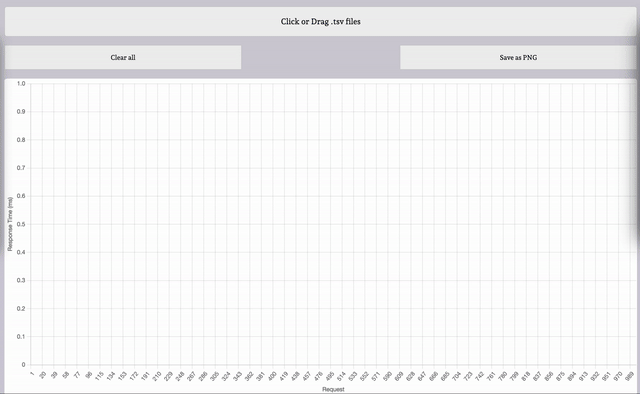

# Plotr

Plots Apache Benchmark output files on a graph.



This is the source code for [this website](https://plotr.pages.dev/).

To generate Apache Benchmark results file in [gnuplot](http://gnuplot.sourceforge.net/) format, add the `-g` flag to the `ab` command:

```shell
ab -n 100 -c 10 ... -g out.tsv
```
